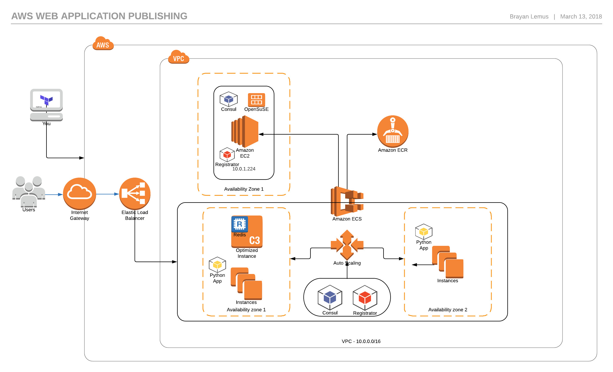

# AWS ECS EC2 CONSUL REGISTRATOR DOCKER FLASK TERRAFORM MODULES AND REDIS

This repository contains the necesary scripts and procdedures to deploy a **simple** Flask App using a Redis DB using Docker Compose with service discovery by Consul and a service registry bridge by Registrator. Also in includes the procedure and the necesary Terraform modules to automate the a **simple** deployment of to AWS using ECS, EC2, ECR, AWS Auto Scaling and ELB. This is only the base for improving.


* [Enviroment](#enviroment)
* [Infrastructure](#aws-infrastructure)
* [Docker Compose](#docker-compose)
* [Amazon Web Services](#aws)
* [Issues](#issues)
## Enviroment
The following work enviroment was used:

* A OpenSuse Leap 42.3 x86_64.
* Python 2.7.13.
* Python pip 9.0.1.
* Terraform v0.11.3
* Docker version 17.09.1-ce, build f4ffd2511ce9
* Docker compose version 1.19.0, build 9e633ef
* AWS-CLI aws-cli/1.14.53 Python/3.4.6 Linux/4.15.4-2-default botocore/1.9.6

I assume that you know what they are and how to install and excute them. Also you should have knowledge about AWS IAM to add a user, get keys the for management and grant the necessary policies.

```bash
aws configure --profile YOUR_PROFILE
```

You should be able to fill the prompts of this command.

## AWS Infrastructure



To do:
* 1 VPC: Virtual Private Cloud, for base networking.
* 2 Public Subnets: This is where all instances are created into.
* 2 Private Subnets: For scaling propuses.
* 1 Internet GW: For internet access.
* 1 Route table: Route to internet access.
* 2 Route table Associations: Public subnets route associations.
* 2 Security groups (ELB, EC2 and ECS): For access, INBOUD and OUTBOUND.
* 1 EC2-ECS Role: For AWS resources access.
* 2 IAM Roles: For resources.
* 2 IAM Policies: For access resources.
* 1 AWS Launch Configuration: ECS -> EC2 instances creation.
* 1 Auto Scaling Group: Autoscale.
* 1 EC2 Instance: Consul server.
* 2 Task Definitions: Containers definitions.
* 2 ECS Services: Containers deployment.
* 1 Elastic load Balancer: To distribute traffic among the ECS instances running the app.

## Docker Compose
In order to test and develop our app locally we use Docker and Docker Compose to set the necesary app enviroment and requirements.

### Simple Redis Task-Note (Credit: Rochana Nana [link](https://www.youtube.com/watch?v=W0ZNEOgsLmY&t=1407s)):
The WEB APP was made in python and uses:
* Flask: As the framework.
* DNSPython: DNS lookups provide by Consul.
* WTForms and Flask_WTF: For the WEB interface.
* Redis: For database storage.

A few modifications where made for the app to work within the AWS enviroment.

### Creating containers images and deploy

The web app image has to be created for docker to be able to use it, along with the images of Consul, Registrator and Redis which we are only going to be downloaded by docker.

Quick way:

```bash
cd WEBAPP
export MYHOST=PUT.YOUR.PRIVATE.IP
docker-compose builld
docker-compose up
```

MYHOST is environment variable which docker uses to specify the Web app, Consul and Registrator where to bind. **This is only for local use**.

Now docker must be running, we can check the services:
* Consul: http://127.0.0.1:8500
* WebApp: http://127.0.0.1/  (the default port is **80**, and is set that way within the scripts)

## AWS

Now that the app is up and running we can deploy the infrastructure and upload our containers to AWS ECS.
Fist we have to get our AWS APIs credentias ready and be able to connect to AWS. You can check this with this command:

```bash
aws ec2 describe-instances --profile YOUR_PROFILE
```

If it connects we are good to go.

### Terraform config and repository creation
Before we can use Terraform we need to set some variables in order to access AWS. Open the file **terraform.tfvars** and modify the variables with your own.

* aws_profile = "YOUR_PROFILE"
* aws_region  = "YOUR_AWS_DEFAULT_REGION"

After that run the following to change into directory, initialice Terraform and run the planner.

```bash
cd ECR
terraform init
terraform plan
```

This is going to show us the plan to create a contenainer repository named **myapp** in AWS, and this is where our images are going to be placed. Also if it works it means that your credentials are ok and we can move on. You should get something like this:

```bash
An execution plan has been generated and is shown below.
Resource actions are indicated with the following symbols:
  + create

Terraform will perform the following actions:

  + aws_ecr_repository.myapp
      id:             <computed>
      arn:            <computed>
      name:           "myapp"
      registry_id:    <computed>
      repository_url: <computed>


Plan: 1 to add, 0 to change, 0 to destroy.
```

If it works run the following:
```bash
terraform apply
```

Type **yes** for confirmation and you should get something like this:

```bash
An execution plan has been generated and is shown below.
Resource actions are indicated with the following symbols:
  + create

Terraform will perform the following actions:

  + aws_ecr_repository.myapp
      id:             <computed>
      arn:            <computed>
      name:           "myapp"
      registry_id:    <computed>
      repository_url: <computed>


Plan: 1 to add, 0 to change, 0 to destroy.

Do you want to perform these actions?
  Terraform will perform the actions described above.
  Only 'yes' will be accepted to approve.

  Enter a value: yes

aws_ecr_repository.myapp: Creating...
  arn:            "" => "<computed>"
  name:           "" => "myapp"
  registry_id:    "" => "<computed>"
  repository_url: "" => "<computed>"
aws_ecr_repository.myapp: Creation complete after 1s (ID: myapp)

Apply complete! Resources: 1 added, 0 changed, 0 destroyed.

Outputs:

myapp-repository-URL = 051627290916.dkr.ecr.us-east-1.amazonaws.com/myapp
```

This URL **051627290916.dkr.ecr.us-east-1.amazonaws.com/myapp** is the URL where we can PUSH our images to the AWS repository using Docker. It will be different for you.

### Image build and upload (PUSH)

In order to push our images to the new repository we need to build our images to be suited for it. MYHOST variable is no longer valid and Consul and Registrator are going to be set in a diferent manner. So we just need to push the images for Redis and the App, those are the only ones that are going to be handle by ECS.  The image name has to match the repositories URL in order to be accepted. Run the following inside the Apps image IMAGES/Flask:

```bash
cd IMAGES/Flask
docker build -t 051627290916.dkr.ecr.us-east-1.amazonaws.com/myapp:myapp .
```

NOTE the **dot (.)** at the end. Format: repository_url:tag, so we are naming our image myapp (stick to the name, is used later on).  Redis is a standard images so we are just going to let AWS to download it. Now run:

```bash
docker images
```
you should get
```bash
REPOSITORY                                            TAG                 IMAGE ID            CREATED             SIZE
051624290916.dkr.ecr.us-east-1.amazonaws.com/myapp    myapp               395e8d316c2a        5 minutes ago       693MB
```

Now we need to PUSH our image, for that we need to get our credentials from AWS in order to do so:
```bash
aws ecr get-login --profile YOUR_PROFILE
```

you will get a command to run in order to login, copy and paste it and try to run it.  IF IT DOESN'T WORK: remove **"-e none"** from the string and run it again. Once you are it says "Login Succeeded" we can PUSH our image:

```bash
docker push 051624290916.dkr.ecr.us-east-1.amazonaws.com/myapp:myapp
```

It will take some time, but after it finishes you shou be able to se your image under **AWS Elastic Container Service** where we can use it.

### Deploy infrastructure

Like before, the first thing you need to do is fill you variables in **terraform.tfvars** after that execute the following.

Now we are ready to deploy the insfrastructure into AWS. (You might need to re-run terraform init again). Move into DEPLOY directory and run: terraform plan, check what is going to happen, you should have **27 to add** resources.

```bash
cd DEPLOY
terraform init
terraform apply
```

Watch Terraform work for you, keep in mind that some resources take longer to provision than others so after terraform finishes it might take some time for AWS to finish provisioning the the whole infrastructure, so be patient. Also, Terraform fails time to time. **IF** you encounter an error run

```bash
terraform destroy
```

that will destroy everything, wait a while and try again.   At the end you should get something like this:

```bash
Apply complete! Resources: 27 added, 0 changed, 0 destroyed.

Outputs:

CONSUL_PUBLIC_IP = 54.198.185.244
ELB_DNS_NAME = myapp-elb-769439976.us-east-1.elb.amazonaws.com
```

* You can SSH to the Consul Public IP using you private key.
* You can see the Consul UI in http://54.198.185.244:8500
* You can use the Web App in http://myapp-elb-769439976.us-east-1.elb.amazonaws.com/
* You can login to AWS and confirm that everything is running.

## Issues

* The Web App works as intended, but it has some connectiviy problems that are not reproducible when it runs on only 1 host. It seems to be related to de ELB or the way ECS handles containers.
* There are no ACLs and ALL the security groups are without any restrictions, this deploy is NOT for production porpuses
* All AWS services have cost related to them, this deploy should NOT be left active for long periods of time, it could provoke economic problems.  (I did it in all within the free tier)
* Even tho the app works, Registrator is discovering the services through the consul agents and server AND the Consul DNS is providing the resolution for redis to be discover, the Python Flask Script is handling the DNS querys in a way that, from my point of view , is harder that it should be. It seems to be  posible to use AWS DNS to make the service discovery more "transparent" to the Apps wihtout having to program the way out to the solution.
